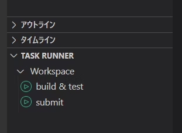

# Docker environment for AtCoder in Rust

We use [cargo-compete](https://github.com/qryxip/cargo-compete)
For detailed usage [here](https://qiita.com/rokoooouribo/items/76a0057c75694fd943f5) (japanese)

## How to use

### Build and test

#### Build and test from command line

```bash:
./bt.bash (Contest Number) (Alphabet in question)
```

#### Click to build and test

With the .rs file you want to test in vscode, click build & test in TASKRUNNER in the lower right corner



### Submit

#### Submit from  command line

```bash:
./sub.bash (Contest Number) (Alphabet in question)
````

#### Click to submit

You can also click submit in TASKRUNNER in the lower right corner with the .rs file you want to submit similarly in the picture above in vscode.

### Debugging

Put your debugging input in input.txt

If you did the build & test on the command line, replace the program in launch.json with the number of the contest you are solving.

set to be rewritten when you click on build & test.

## Caution

If you want to operate from command line, please rewrite launch.json, bt.bash and sub.bash for each abc, arc and agc.